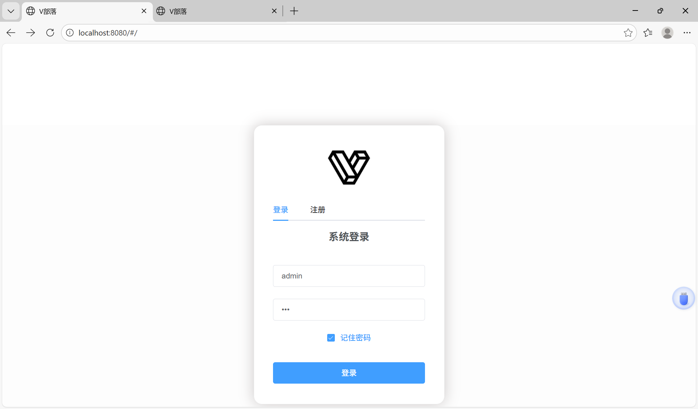
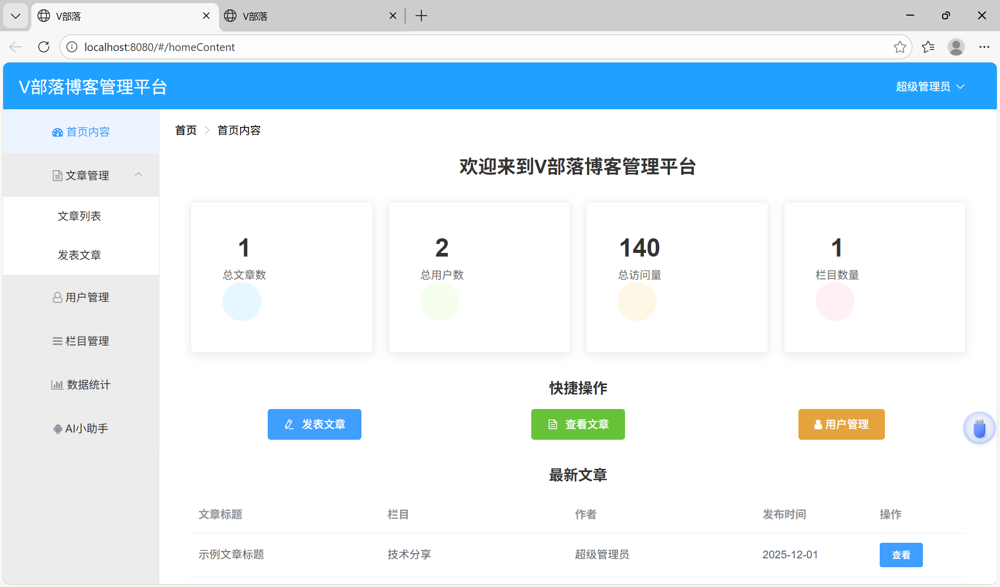
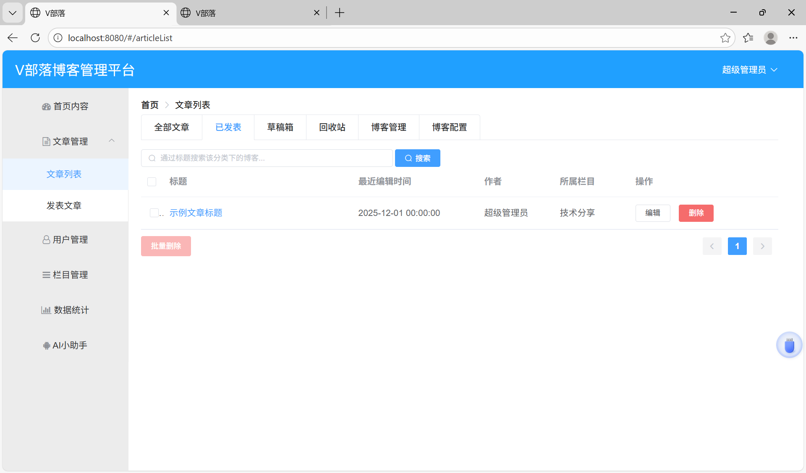
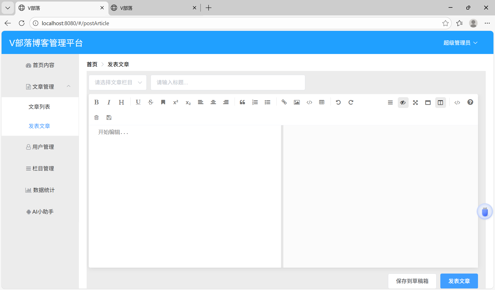
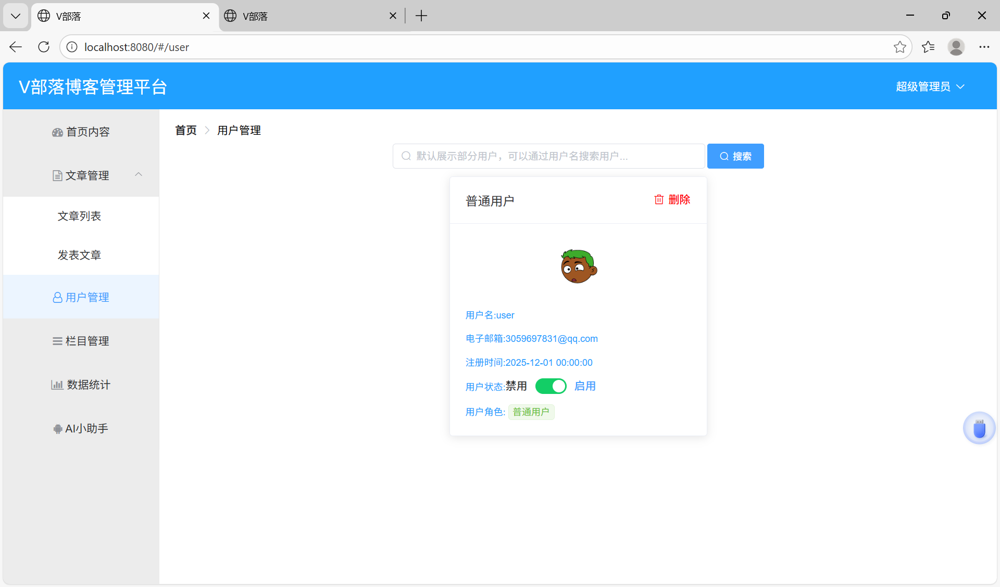
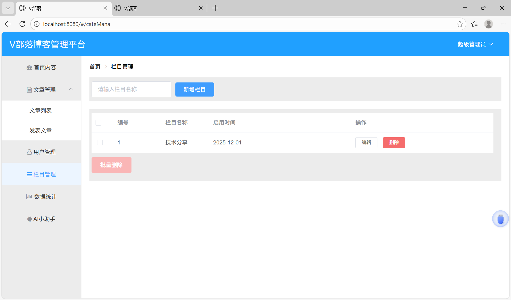
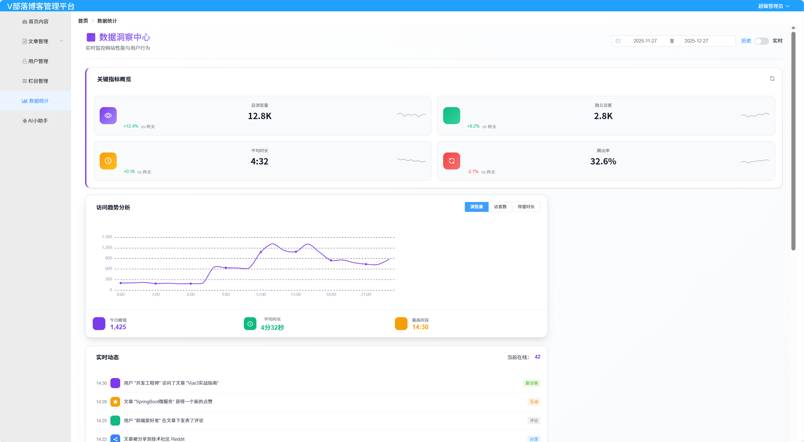
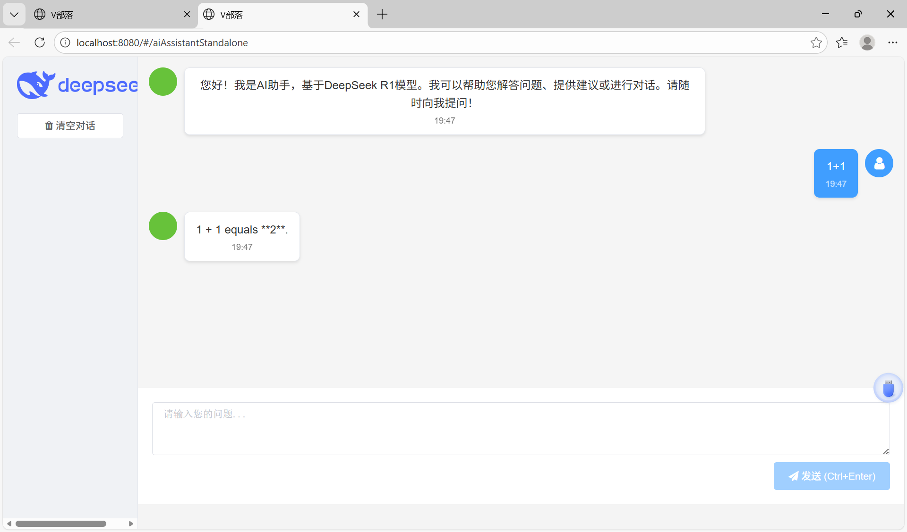

# my_VBlog 项目说明

项目演示地址：  
http://localhost:8080/#/

---

## 项目效果图

> 以下截图均来自项目 `pictures` 文件夹

### 登录页面


### 首页内容


### 文章列表


### 发表文章


### 用户管理


### 栏目管理


### 数据统计
(pictures/charts2.png)

### AI 功能


---

## 技术栈

### 后端技术栈
- Spring Boot
- Spring Security
- MyBatis
- MySQL 5.7+
- RESTful API
- Token 认证
- BCrypt 密码加密

### 前端技术栈
- Vue 2.x
- vue-router
- axios
- Element UI
- vue-echarts
- mavon-editor
- Webpack

---

## 快速运行

### 1. 克隆项目
```bash
git clone https://github.com/x-xiaozhang/my_VBlog.git
```

### 2. 初始化数据库
在 `blogserver/resources` 目录下找到 `vueblog.sql`，并在 MySQL 中执行。

### 3. 启动 Ollama（如使用 AI 功能）
```bash
ollama serve
ollama run deepseek-r1:7b
```

### 4. 启动后端
```bash
cd blogserver
mvnw.cmd clean install
cd target
java -jar vblog-1.jar
```

### 5. 启动前端
```bash
cd vueblog
npm install
npm run dev
```

访问地址：http://localhost:8080

---

